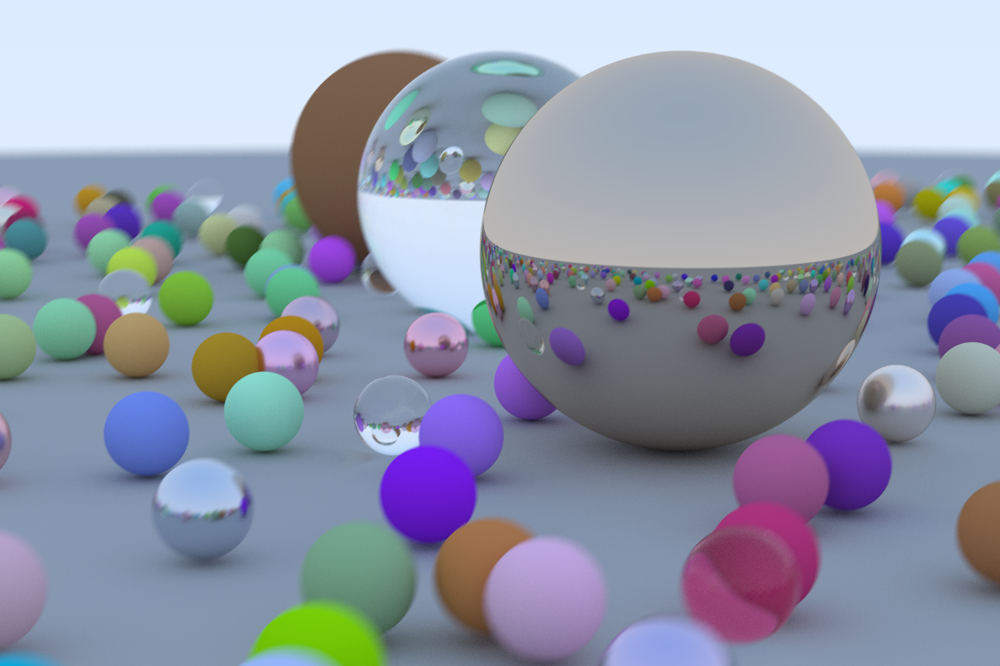

For a while, I've been wanting to hone my Zig skills and also have some cool product to show for it. So I tried follwing Peter Shirley's [_Ray Tracing in One Weekend_](https://raytracing.github.io/books/RayTracingInOneWeekend.html), but ofcourse, adapting it to Zig.

First of all, I must say, that Shirley's treatment is just *amazing*. I learnt a lot, and the hands on experience of generating images at each stage after adding more and more features really motivated me to keep going.

Secondly, doing this mini-project made me appreciate Zig's simplicity a lot. I really like the "interface pattern" that Zig uses. I find it more verbose than other languages' implementations for runtime polymorphism. No more sneaky vtables and dynamic dispatch lurking in the shadows. What you see is what you get.

It's a pretty short post, so I think ill just add an image I generated, and [link](https://github.com/iamgweej/zigrtrc) to to projects github:

